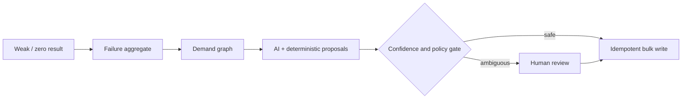
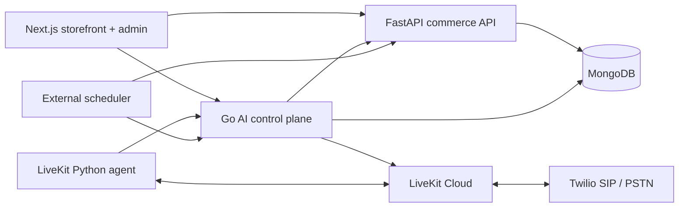

# StylMe

**StylMe is a Personal Fashion Concierge for Bharat.** It combines a shopper’s saved preferences with the current occasion, mood, budget, location and delivery need, then uses permissioned commerce tools to rank real, sellable fashion.

Built by **Team Arisyn** for Myntra WeForShe HackerRamp 2026.

- Team Leader: Avni Singhal
- Team Member: Hanee Joshi
- Selected theme: **The Bharat Opportunity**
- Live MVP: <https://stylme-swoopstyl.vercel.app>

## The problem

Tier 2 and Tier 3 shoppers often describe fashion in Hindi, Hinglish or regional context:

> Kal cousin ki mehendi hai. Udaipur vibe, modern but not loud, under ₹2,500—and I need it fast.

That sentence carries language, occasion, place, aesthetic, budget and urgency. Conventional catalogue filters preserve only a fraction of it. The context is then lost again between search, delivery, inbound support and checkout recovery.

StylMe treats this as one connected shopper-intent problem:

1. **Discover:** understand the person and the use case.
2. **Trust:** expose only real products and verified delivery eligibility.
3. **Convert:** continue context through inbound and outbound agents.
4. **Learn:** turn weak searches into safe, reviewable taxonomy intelligence.

## Core features

### Personal Fashion Concierge

The storefront concierge is not generic web search. It combines:

- saved style and colour preferences;
- optional age/fit context;
- occasion, mood and identity;
- city, pincode and delivery urgency;
- budget and explicit product constraints.

The reasoning layer may widen meaning, but deterministic catalogue contracts decide what can be displayed.

### Hybrid and graph search

Advanced search supports:

- Hindi, Hinglish and Indian-English concepts;
- indirect intent such as `sundar`, `white color ka`, `phoolon wala` and `fast moving`;
- misspelling repair using edit distance and character-bigram similarity;
- price phrases such as `Rs 5600`, `under`, `at most`, `above` and ranges;
- taxonomy-graph expansion and sparse-vector cosine ranking;
- active-offer, stock and visibility joins;
- four controlled fallback levels for weak or zero results.

A six-digit token is treated as a pincode only when SwoopStyl is active and the token is at the end of the query.

### Optional Fit Passport

Shoppers can consent to use:

- age band;
- height;
- known size and preferred silhouette;
- optional weight;
- generation, aesthetic, occasion and colour preferences.

Measurements are optional, purpose-limited and deletable. The product does not claim “perfect fit.” Photos are optional and are not saved.

### SwoopStyl

SwoopStyl is the delivery-aware discovery layer:

- activates only when fast delivery is requested;
- validates pincode and nearby seller inventory;
- ranks the fastest eligible styles first;
- displays one-day delivery only when inventory and serviceability prove it.

Minute-level delivery is a future extension for locations where fulfilment can verify the promise.

### Agent Studio and commerce-tool extension

Web, inbound and outbound agents reuse one permissioned Myntra MCP-style commerce contract:

- profile context;
- catalogue search;
- delivery eligibility;
- cart and checkout context;
- order support;
- human handoff.

The tool layer prevents agents from inventing product, stock, delivery or order facts.

### Inbound agent workflow

The default inbound DAG contains:

- a low-latency multilingual router;
- Fashion Shopping Concierge;
- Order Support Specialist;
- Returns and After-sales Specialist;
- Customer Care Specialist;
- Human Support Handoff.

Specialists can warm-transfer the live call to a human when confidence, policy or shopper preference requires it.

### Outbound checkout recovery

The recovery workflow is designed as a consent-aware service conversation:

- unpaid active-cart discovery;
- calling windows and concurrency limits;
- Hindi-first campaign configuration;
- eleven configured regional languages;
- opt-out and consent safeguards;
- immutable call/campaign snapshot;
- final disposition and captured outcomes;
- protected cron and dispatch endpoints.

Tier 2/3 geographic campaign segmentation is a roadmap control; it is not claimed as current scheduler behaviour.

### Demand-learning reconciler

Weak and zero-result queries feed a safe retagging loop:



The completed regional-demand run:

- seeded 100 Hindi/Hinglish/Indian-English queries;
- scanned 47,725 eligible products;
- updated 40,605 products;
- added 102,585 controlled tags;
- held 75 ambiguous edges for review;
- updated zero excluded products.

## Architecture



| Plane | Technology | Responsibility |
|---|---|---|
| Client | Next.js / React | Storefront, search, profile and admin experiences |
| Commerce | FastAPI / Python | Identity, products, offers, filters, search, carts and orders |
| AI + tools | Go | Agents, swarms, campaigns, calls and shared commerce tools |
| Voice | LiveKit Agents / Python | Real-time STT, reasoning, TTS and handoffs |
| Data | MongoDB | Catalogue, offers, profiles, graphs, state and audit |
| Telephony | LiveKit Cloud + Twilio | SIP/PSTN transport and agent dispatch |

More detail: [SYSTEM_DESIGN.md](SYSTEM_DESIGN.md)

## Repository layout

```text
.
├── frontend/       Next.js storefront and admin
├── backend/        FastAPI commerce API
├── Go-Backend/     AI control plane, agents and campaigns
├── Livekit-Agent/  Real-time voice worker
├── data/           Catalogue, migration and index tooling
├── scripts/        Root setup, dev, test and packaging commands
├── presentation/   HackerRamp deck, screenshots, scripts and assets
├── SETUP.md        Full local and production handoff
└── SYSTEM_DESIGN.md
```

## Prerequisites

- Node.js 20+
- npm 10+
- Python 3.12
- Go 1.26+
- `uv`
- MongoDB
- Optional voice stack: LiveKit Cloud, LiveKit CLI and Twilio SIP

## Quick start

```bash
cp .env.example .env
npm run setup
npm run db:init
npm run dev
```

`npm run setup` installs the workspaces in parallel. `npm run dev` starts:

- Next.js on `http://localhost:3000`
- FastAPI on `http://localhost:8000`
- Go control plane on `http://localhost:8081`

Start the voice worker too:

```bash
npm run dev:all
```

Full environment and telephony instructions: [SETUP.md](SETUP.md)

## Environment

Use the root `.env` as the private local source. Start from `.env.example`.

Required groups:

- MongoDB URL and database;
- JWT/bootstrap owner values;
- internal and cron secrets;
- browser-safe public API URLs;
- OpenAI/provider keys;
- LiveKit project values;
- Deepgram and Sarvam keys;
- Twilio SIP values.

Never commit `.env`. Never expose secrets through `NEXT_PUBLIC_*`. The share package deliberately excludes real credentials.

## Useful commands

| Command | Purpose |
|---|---|
| `npm run setup` | Install all workspaces |
| `npm run dev` | Start frontend, FastAPI and Go |
| `npm run dev:all` | Start the core stack plus voice |
| `npm test` | Run repository tests |
| `npm run test:e2e` | Run frontend E2E tests |
| `npm run db:init` | Create indexes and managed metadata |
| `npm run db:optimize` | Apply catalogue query indexes |
| `npm run taxonomy:demand:seed` | Seed the 100-query regional demand pack |
| `npm run taxonomy:retag:dry` | Inspect one safe retagging batch |
| `npm run taxonomy:retag:full` | Run deterministic full-catalogue retagging |
| `npm run taxonomy:retag:resume` | Resume from a persisted cursor |
| `npm run package:share` | Build a credential-free share package |

## Protected scheduled jobs

### Voice dispatch

```http
POST /v1/runtime/dispatch?limit=5
X-Internal-Key: <AI_INTERNAL_API_KEY>
```

Recommended interval for serverless deployment: one minute.

### Abandoned-checkout orchestration

```http
POST /v1/workflows/abandoned-checkout
X-Internal-Key: <AI_INTERNAL_API_KEY>
Content-Type: application/json

{"limit":100}
```

Recommended interval: five minutes.

### Taxonomy reconciler

```http
POST /api/v1/public/taxonomy-reconciler/run
X-Cron-Secret: <CRON_SECRET>
Content-Type: application/json

{
  "maxQueries": 30,
  "maxProducts": 250,
  "graphDepth": 4,
  "useAi": true,
  "rebuildGraph": false,
  "apply": true
}
```

Use one scheduler per job. Do not run both the Go workflow and the legacy FastAPI recovery scheduler.

## Testing

```bash
npm test
npm run test:e2e
```

Implementation tests cover catalogue, search, profile personalization, taxonomy reconciliation, voice routing and workflow safety. Live external provider calls require separately configured test credentials.

## Deployment

The production topology uses separate deployments for:

- Next.js storefront/admin;
- FastAPI catalogue API;
- Go AI control plane;
- LiveKit voice agent.

MongoDB Atlas provides durable state. LiveKit Cloud and Twilio provide real-time media and PSTN/SIP connectivity.

Set server secrets in each provider’s environment settings. Do not rely on a local `.env` being uploaded.

## Presentation and demo

The HackerRamp pack is under:

[presentation/hackerramp-submission](presentation/hackerramp-submission)

It contains:

- a 10-slide PPTX and matching PDF;
- a five-minute pitch script;
- a four-minute MVP walkthrough;
- feature/theme mapping;
- research sources;
- selected screenshots and generated roadmap art.

Before submission, replace `InstituteName` in the deck and PDF filenames with the registered institute name.

## Safety and privacy

- Optional measurement data requires explicit consent.
- Appearance photos are transient and are not stored.
- Obvious email, phone and card-like strings are redacted from search-failure aggregates.
- Outbound calls respect consent, calling windows and opt-out.
- Provider credentials are encrypted or supplied through server environments.
- Product retagging is bounded, allowlisted, idempotent and auditable.
- Intimate, underwear, lingerie, sleep, swim, hosiery and thermal-underlayer products are excluded from the curated/retagging pipeline.

## Licence and third-party services

This repository is private and currently marked `UNLICENSED`.

Third-party services include OpenAI, Deepgram, Sarvam, LiveKit, Twilio, MongoDB Atlas and Vercel. Review each provider’s terms, data handling and licensing before production use.