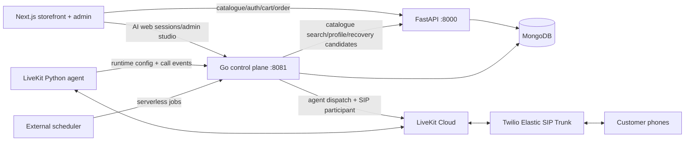
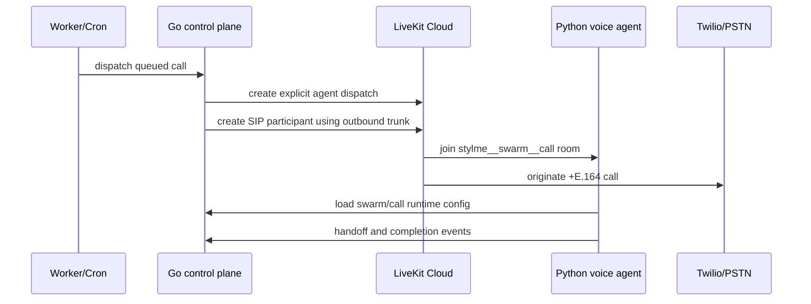
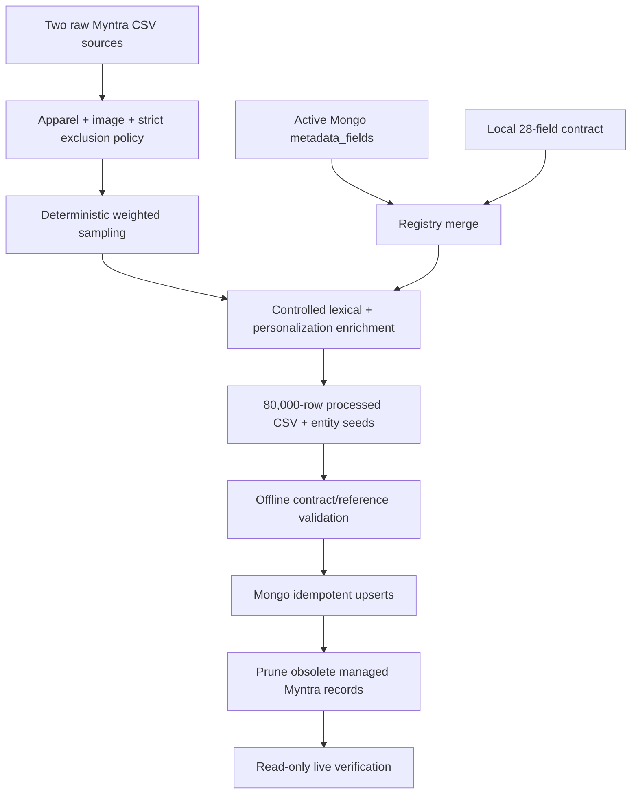
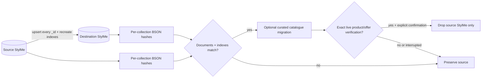
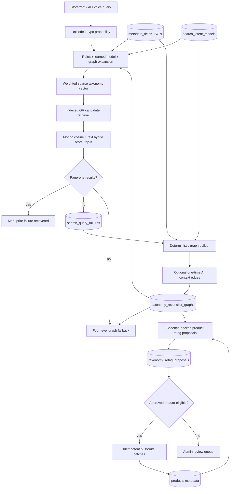

# StylMe system design

## System map

## Responsibilities and boundaries

| Component | Owns | Must not own |
|---|---|---|
| Next.js | storefront/admin UX, browser-safe API calls, local presentation state | provider secrets, SIP IDs, direct Mongo access |
| FastAPI | identity, profiles, taxonomy/filter API, products/offers, carts/orders, checkout activity/recovery feed | realtime voice sessions or SIP dispatch |
| Go control plane | AI agents/tools/swarms/campaigns, credential vault, web AI sessions, call queue, LiveKit dispatch | product source-of-truth writes |
| LiveKit worker | realtime audio pipeline, tool execution, graph handoffs, call completion events | admin configuration persistence or cron scheduling |
| MongoDB | durable state shared through explicit collection ownership | transient audio/media transport |
| LiveKit Cloud/Twilio | realtime rooms/agent capacity and PSTN/SIP transport | commerce or customer-profile source of truth |

FastAPI and Go deliberately share MongoDB but write separate domains. Cross-service behavior uses HTTP contracts instead of importing one service's internal code.

## Runtime requests

### Catalogue and personalization

1. Next.js serves static storefront route shells; the hydrated browser fetches home, catalogue, filter, search, and product-detail data directly from FastAPI.
2. A public endpoint resolver prevents deployed browsers from inheriting a developer `localhost` API URL.
3. The browser authenticates against FastAPI.
4. FastAPI stores only explicit profile preferences and consented measurements.
5. Search combines the current query with compatible department/age/fit signals and soft metadata ranking.
6. Soft metadata supports `style`, `generation`, `aesthetic`, `occasion`, `festival`, `personalization_segment`, and reviewed color families.
7. Current query intent wins over profile fallbacks; measurements are dropped when the query switches to an incompatible department.

### Web AI

1. The browser creates a Go `/v1/web/sessions` session.
2. Go returns a short-lived session token and public agent presentation.
3. Each message is planned by the selected agent, with controlled tools calling FastAPI catalogue/profile endpoints.
4. Provider credentials remain encrypted in MongoDB or supplied through server environment fallbacks.

### Outbound voice

Every call gets an isolated room named from swarm and call IDs. Go persists idempotency and call status. LiveKit connects the SIP participant to the same room as the explicitly dispatched `stylme-voice` agent. The current [LiveKit outbound-call model](https://docs.livekit.io/telephony/making-calls/outbound-calls/) uses an outbound trunk plus `CreateSIPParticipant`, which matches `Go-Backend/internal/livekit/gateway.go`.

### Inbound voice

Twilio sends the incoming PSTN call to the LiveKit SIP endpoint. The LiveKit inbound trunk accepts the provider/number, then the dispatch rule chooses a new room and explicitly dispatches `stylme-voice`. The agent reports the inbound call to Go, loads the default inbound swarm, executes the graph, and reports handoffs/completion. A dispatch rule is the authoritative room-routing mechanism in [LiveKit's inbound model](https://docs.livekit.io/telephony/accepting-calls/dispatch-rule/).

## Catalogue migration and taxonomy

The `curated-youth-festive` policy excludes intimate apparel, underwear, lingerie, sleep/loungewear, swimwear, hosiery, and thermal underlayers using exact product types plus boundary-aware title/URL terms. Weighted quotas retain breadth across allowed product types while favoring festive clothing, dresses, contemporary Gen Z signals, and children's/Gen Alpha clothing.

The registry merge preserves active database fields/options, adds local fields absent from MongoDB, and adds newly observed categories/product types/colors/sizes. All product metadata is emitted against the merged options, then the seeder upserts `metadata_fields` before products. This makes filters data-driven instead of hard-coded.

The pipeline is deterministic for the same raw data and seed. The generated artefacts record pipeline version, seed, taxonomy source, row counts, cohort coverage, and content hash. It does not claim image-model verification; deterministic/lexical metadata provenance remains explicit in `system_metadata` and AI enrichment stays a separate audited pipeline.

### Cross-cluster cutover safety

The copy report never stores credentials. Source deletion is a separate command requiring `--apply`, the exact database name, a valid copy report, a valid 80,000-row destination report, and a final live count check. The current handoff took the preserve branch because the catalogue expansion was stopped after partial destination writes.

## Data ownership

| Collection family | Primary writer |
|---|---|
| `users`, `sellers`, `products`, `seller_offers`, `brands`, `colors`, `metadata_fields`, carts/orders, checkout recovery | FastAPI and the explicit data seeder |
| `agents`, `agent_swarms`, `campaigns`, `calls`, `ai_sessions`, encrypted provider credentials | Go control plane |
| `app_configs`, `import_jobs`, `audit_logs`, filter caches | the owning API/seeder workflow |

Catalogue pruning is scoped to products whose source is `myntra_detailed` or `myntra_large`. User-created/admin-created products are outside that filter. Offers are removed only when their obsolete managed product is removed. Filter-cache invalidation occurs only after the new products/offers are successfully upserted.

## Jobs and deployment modes

| Job | Long-running deployment | Serverless deployment |
|---|---|---|
| queued call dispatch | `CALL_WORKER_ENABLED=true`, polling at `CALL_WORKER_INTERVAL` | `POST /v1/runtime/dispatch?limit=5` every minute with `X-Internal-Key` |
| abandoned checkout | `POST /v1/workflows/abandoned-checkout` every 5 minutes, or an in-process scheduler supplied by the host | same protected endpoint through Vercel Cron/Cloud Scheduler |
| legacy FastAPI recovery | disabled when Go workflow is used | alternative `GET /api/v1/public/checkout-recovery/run` with `X-Cron-Secret` |
| catalogue migration | manual/controlled operation | manual/CI job, never a request-time function |
| taxonomy reconciliation | scheduled protected POST, normally daily | protected POST from cron-job.org/another external scheduler, or optional Vercel GET with Bearer `CRON_SECRET`—not both |

Run only one dispatcher mode and one checkout-recovery mode. MongoDB uniqueness keys make call scheduling/imports idempotent, but duplicate schedulers still waste capacity and complicate operations.

## Search reconciliation and retagging graph

The request-time ranker is deliberately a sparse taxonomy vector rather than a mandatory dense-embedding dependency. A query dimension is `field:value → confidence`; a product dimension is present when its controlled core field or metadata array contains that value. MongoDB calculates the dot product and vector norms, ranks by cosine similarity, blends text score when residual lexical terms remain, limits to the top candidate set, and then joins sellable offers. This uses the catalogue's complete controlled metadata immediately, remains explainable, and avoids an embedding backfill or a second vector store. Exact shopper-selected filters still form the Mongo match predicate.

Advanced-search scalar parsing is intentionally separate from semantic traversal. Currency markers and comparative phrases compile to price bounds first. A trailing six-digit token compiles to a pincode only when SwoopStyl is enabled; otherwise it has no geographic effect. SwoopStyl candidates must have positive inventory at a serviceable seller location inside the requested radius. Their final score blends the logistics score (70%) with taxonomy-vector similarity (30%), while ordinary search continues to use the Mongo text-plus-vector score.

Indirect intent is resolved in two stages. During reconciliation, AI decomposes failed queries into product nouns, activity verbs, descriptors, occasions, weather, desired effect, recipient language, price, and delivery constraints, then proposes edges only to live controlled taxonomy values. At request time, the stored graph and audited linguistic seeds expand these concepts into soft vector dimensions; direct product nouns and shopper-selected filters remain authoritative. This allows phrases such as “fast moving” to rank sporty/workout/relaxed products without adding an LLM network call to every search.

The graph is undirected and has a hard four-level semantic budget:

| Level | Meaning |
|---:|---|
| 1 | exact live taxonomy label/alias or explicit Indian search concept |
| 2 | context-to-taxonomy or learned catalogue association |
| 3 | one controlled taxonomy-neighbour expansion |
| 4 | eligible products, resolved from their indexed metadata and active offers |

Products are virtual terminal graph nodes: their existing `category_key`, `product_type_key`, `gender_keys`, and controlled `metadata` arrays form the adjacency. Materializing every product-to-tag edge in another collection would multiply tens of thousands of products by many facets and waste Atlas storage; traversal instead joins graph signals to the existing product indexes at request time.

The deterministic builder merges live option names/aliases, the trained token-to-filter model, product-derived co-occurrence evidence already summarized by that model, and conservative Indian context seeds. For example, “clothes for Udaipur” can reach ethnic, desi-fusion, summer, cotton, and relevant allowed apparel types. Generation, gender, festival, mood, cultural-theme, and other identity-like/subjective fields require explicit query words and cannot be inferred through a city or style path. The strict no-intimates policy is also applied to graph nodes and all fallback inventory.

AI is invoked only while rebuilding a changed graph. It receives failed-query aggregates plus the current allowlisted taxonomy, returns strict schema-constrained context edges, stores no response state, and cannot emit an unknown target value. AI edges never directly mutate products. A model refusal, timeout, invalid payload, or missing key leaves the deterministic graph usable.

Retagging is a ledgered process rather than a blind rewrite. Each unique product/field/value proposal stores the latest graph version, confidence, query hashes, and evidence without resetting a prior admin decision on retry. Direct lexical evidence can auto-apply; exceptionally strong catalogue co-occurrence can auto-apply above the configured threshold; other edges require an admin decision. A versioned 100-query Indian demand pack supplies Hindi, transliterated Hindi, Hinglish, and Indian-English concepts, but every target is intersected with the live database taxonomy before it can enter the graph.

The catalogue runner has a fixed safety budget of 12 proposals per product and two per field, excludes intimate/sleep/swim/hosiery/thermal inventory before scanning, and only writes approved product-metadata fields. Graph node, adjacency, start-phrase, and allowed-value indexes are built once per batch. Proposal staging uses a single indexed key lookup plus unordered insertion, while application prefetches selected products once, enforces current field limits in memory, and emits one consolidated `$addToSet` update per product. Workflow locks, unique proposal keys, run records, audit logs, and cache invalidation make full reruns and cursor resumes idempotent without a long multi-document transaction.

Search failure storage is privacy-bounded: obvious emails, Indian phone numbers, and card-like sequences are redacted before aggregation, request context is size-limited, and aggregates expire after the configured retention window. Failure capture is best-effort and never makes a customer search fail.

## Security model

- Customer/admin routes use HS256 access tokens; Go revalidates issuer, expiry, token type, and roles.
- Internal Go routes require constant-time matching of `X-Internal-Key` (or `X-API-Key`).
- FastAPI recovery feeds require `X-Cron-Secret`; the Go internal key and FastAPI cron secret must match for the current Go-to-FastAPI workflow.
- Provider credentials are encrypted before persistence; browser responses redact managed telephony fields.
- `.env` is the single local secret source and is excluded from Git/share packages.
- Body measurements are used only with explicit consent. Appearance photos are transient and recommendations require review.
- SIP phone numbers are E.164. Prefer TLS/SRTP where both LiveKit and the provider are configured for it; current options are described in [LiveKit secure trunking](https://docs.livekit.io/telephony/features/secure-trunking/).

## Failure behavior and observability

- Root `npm run dev` treats any child exit as a stack failure and terminates the other services.
- FastAPI and Go fail startup if MongoDB/index initialization fails.
- Go HTTP timeouts bound requests; its server performs graceful shutdown.
- Call dispatch is retried from persisted queued state; `DispatchOne/DispatchBatch` controls concurrency.
- The seeder validates before connecting, performs upserts before pruning, records an import job/audit log, invalidates derived filter cache, then runs independent read-only verification.
- The taxonomy reconciler records every run, uses a bounded lock, stages proposals before writes, and preserves deterministic fallback when the graph or AI provider is unavailable.
- LiveKit Cloud provides deployment/session logs and managed scaling; the Python project also has pytest and Ruff gates.

## Production topology

- Deploy Next.js, FastAPI, and Go as separate services with the same relevant server environment values.
- Use MongoDB Atlas (or an equivalently secured Mongo deployment) with network rules and least-privilege users.
- Prefer a long-running Go service when low-latency call dispatch is required. If Go is serverless, keep `CALL_WORKER_ENABLED=false` and use authenticated external schedules.
- Deploy the Python agent on LiveKit Cloud. Current LiveKit guidance supports managed builds, secrets, logs, scaling, and rollbacks through the CLI: [agent deployments](https://docs.livekit.io/deploy/agents/managing-deployments/).
- Twilio's trunk Origination routes inbound PSTN traffic toward LiveKit; Termination accepts outbound LiveKit traffic toward PSTN. Do not pin to a single Twilio IP; follow the provider's current signalling/media allow-list and redundancy guidance.
